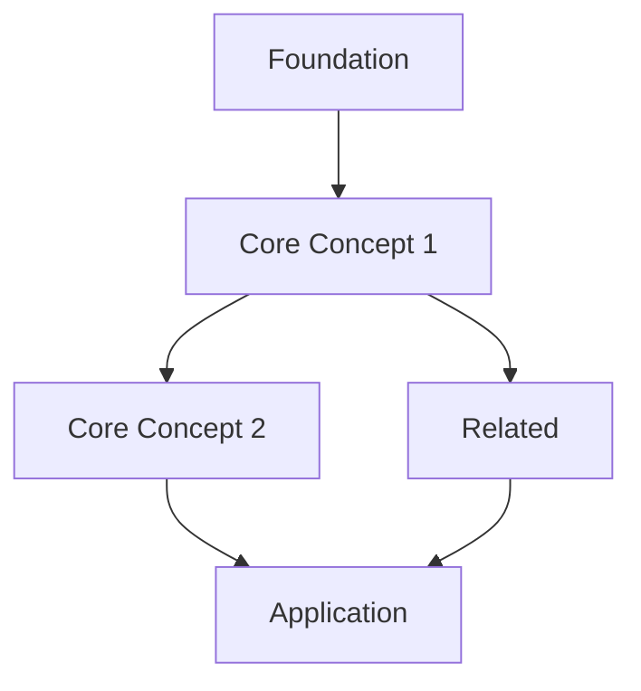

# Lecture Processing Style Guide

This guide ensures consistent output across all lecture processing runs. **All agents involved in `/lecture` must follow these standards.**

## Reference Sources

| Aspect | Reference |
|--------|-----------|
| Atomic note granularity | Your first processed lecture's `Atomic/` folder (or this guide's examples) |
| Mermaid diagram style | Your first processed lecture's MOC (or this guide's examples) |
| MOC section format | **This style guide** (see examples below) |

> **First-time users:** This guide contains all the examples you need. After processing your first lecture, you can optionally use its outputs as reference examples for future runs.

---

## Atomic Notes

### Quantity Target

| Lecture Length | Target Atomic Notes |
|----------------|---------------------|
| 45 minutes | 8-10 notes |
| 60 minutes | 10-12 notes |
| **90 minutes** | **12-18 notes** |
| 120 minutes | 16-22 notes |

**Default for standard lectures: 12-18 atomic notes**

Override with `--atomic-count` parameter if needed.

### Granularity Principle

Extract **coarse concepts**, not fine definitions.

**Too granular (avoid):**
- "Nash equilibrium is mutual best response"
- "Nash equilibrium may not exist in pure strategies"
- "Mixed strategies enable Nash equilibrium existence"
- "Finding Nash equilibria is computationally hard"

**Correct granularity (prefer):**
- "Nash equilibrium captures strategic stability through mutual best response"
  - (Covers definition, existence conditions, and computational aspects in one note)

### Title Format

Titles must be **complete statements**, not topic labels.

| Bad (topic label) | Good (statement) |
|-------------------|------------------|
| "Nash Equilibrium" | "Nash equilibrium captures strategic stability" |
| "Pareto Optimality" | "Pareto optimality means no improvement without harm" |
| "First-Order Logic Syntax" | "First-order logic balances expressiveness with feasibility" |

### Content Structure

Each atomic note should:
1. **Open with the core claim** (2-3 sentences, self-contained)
2. **Add nuance** if needed (1-2 sentences)
3. **Include slide reference** if verified (see rules below)
4. **Link to 2-4 related notes** (not more)

### Slide Assignment Rules

**CRITICAL: `slide-descriptions.md` is mandatory when slides exist.**

| Rule | Rationale |
|------|-----------|
| Read `slide-descriptions.md` to match concepts | Efficient: one file read vs. viewing N slides |
| **NEVER guess from transcript** | Lecturer's "this slide" references are unreliable |
| **NEVER view slides individually** | Computationally expensive, use descriptions file |
| If descriptions missing → STOP | Go back to Step 2 and create it first |

**Why:** Viewing 50+ slide images per atomic note is token-expensive. The descriptions file (created once by Haiku in Step 2) enables efficient matching.

### Slide Linking Format

**CRITICAL: Always use full relative paths for slide embeds.**

Multiple courses have identically-named slide files (`Slide_01.png`, `Slide_02.png`, etc.). Without full paths, Obsidian resolves ambiguously and may embed slides from the wrong lecture.

| Wrong | Correct |
|-------|---------|
| `![[Slide_34.png]]` | `![[AIL/Lecture 09/Folien Bilder/Slide_34.png]]` |

**Format:** `![[{Course}/Lecture {NN}/Folien Bilder/Slide_{NN}.png]]`

**Examples:**
- `![[AIL/Lecture 09/Folien Bilder/Slide_34.png]]`
- `![[UDMT/Lecture 05/Folien Bilder/Slide_12.png]]`

---

## MOC Structure

### Template

Use `Templates/Lecture MOC Template.md`

### Mermaid Diagram

**Style: Simple linear flow**



**Guidelines:**
- Maximum **15 nodes**
- No subgraphs (keep flat structure)
- Short labels (2-4 words per node)
- Linear flow with limited branching

### Section Format

**Combine prose introductions with tables:**

```markdown
## Foundations

Every logic has three components that work together: what you can write (syntax),
what it means (semantics), and how to prove things (calculus).

| Note | Key Idea |
|------|----------|
| [[First-order logic balances expressiveness with feasibility]] | Sweet spot between power and tractability |
| [[Logic consists of three components]] | Syntax, semantics, calculus work together |

---

## Semantics

FOL formulas get meaning through structures - domains of objects with interpretations
for symbols. Truth isn't absolute; it's relative to a structure.

| Note | Key Idea |
|------|----------|
| [[Structures are the basic semantic unit]] | Domains + interpretations |
| [[Entailment means truth preservation]] | True in ALL structures |
```

**Pattern:** 1-2 sentence intro → table with notes + one-line insights → separator

### Section Count

Target: **4-6 sections** per MOC (not more)

---

## Summary Structure

### Length

| Lecture Length | Summary Target |
|----------------|----------------|
| 45 minutes | 150-200 lines |
| 60 minutes | 200-250 lines |
| **90 minutes** | **250-300 lines** |
| 120 minutes | 300-350 lines |

### Compression Ratio

Aim for **10:1 compression** — a 90-minute lecture (~10,000 words) becomes ~1,000 words summary.

---

## Consistency Checklist

Before finalizing lecture processing, verify:

- [ ] Atomic note count within target range (12-18 for 90 min)
- [ ] All titles are statements, not labels
- [ ] **Slide assignments verified** (read slide-descriptions.md, never guess from transcript)
- [ ] **Slide links use full paths** (e.g., `![[AIL/Lecture 09/Folien Bilder/Slide_01.png]]`)
- [ ] MOC has 4-6 sections with prose + tables
- [ ] Mermaid diagram is simple (≤15 nodes, no subgraphs)
- [ ] Cross-course connections identified
- [ ] Section format matches examples in this guide

---

## Override Parameters

When invoking `/lecture`, these parameters override defaults:

```
--atomic-count 8-10      # Fewer, coarser notes
--atomic-count 15-18     # More, finer notes (dense material)
--moc-sections 3         # Simpler MOC
--skip-mermaid           # No diagram
```

---

*Last updated: 2026-01-02*
