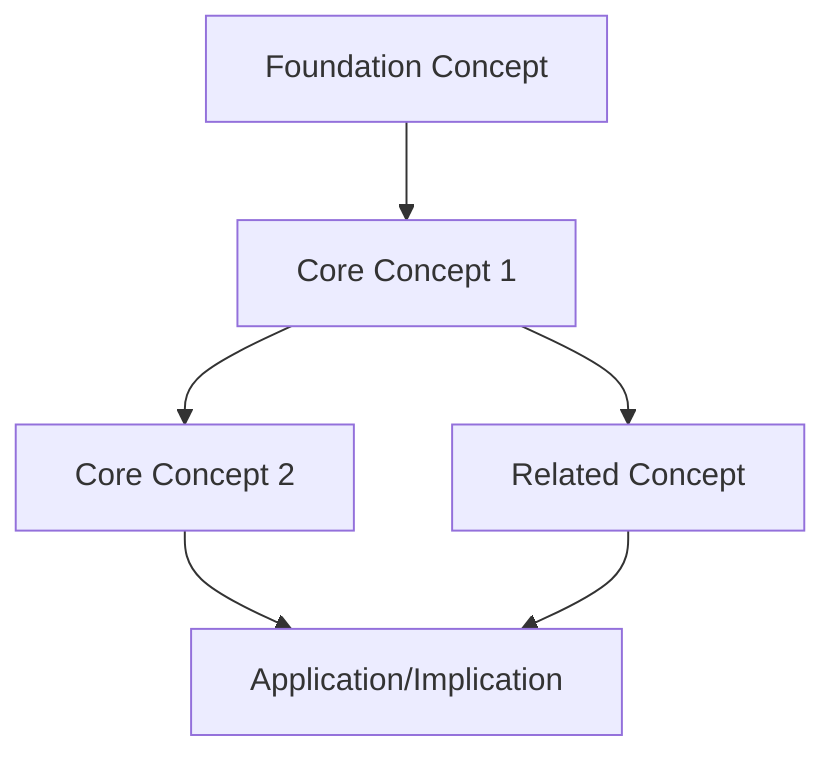

# MOC - {{Topic Title}}

{{1-2 sentence overview of what this MOC covers and why it matters.}}

## Source Material

- [[{{Lecture Transcript}}]]
- [[Summary - {{lecture_title}}]]

---

## Concept Flow

<!-- Mermaid: ≤15 nodes, no subgraphs, short labels (2-4 words) -->



*{{Brief explanation of the flow: how concepts build on each other.}}*

---

## {{Section 1: Foundations}}

{{1-2 sentences introducing this section.}}

| Note | Key Idea |
|------|----------|
| [[Atomic Note 1]] | {{One-line insight}} |
| [[Atomic Note 2]] | {{One-line insight}} |

---

## {{Section 2: Core Concepts}}

{{1-2 sentences introducing this section.}}

| Note | Key Idea |
|------|----------|
| [[Atomic Note 3]] | {{One-line insight}} |
| [[Atomic Note 4]] | {{One-line insight}} |

---

## {{Section 3: Applications/Implications}}

{{1-2 sentences introducing this section.}}

| Note | Key Idea |
|------|----------|
| [[Atomic Note 5]] | {{One-line insight}} |
| [[Atomic Note 6]] | {{One-line insight}} |

---

## Key Relationships

```
{{Concept A}} ⊂ {{Concept B}} (subset/special case)
{{Concept C}} ↔ {{Concept D}} (bidirectional relationship)
{{Concept E}} → {{Concept F}} (implies/leads to)
```

---

## Cross-Course Connections

| This Lecture | Related Lecture |
|--------------|-----------------|
| [[Atomic Note X]] | ↔ [[Related Note from Other Lecture]] |

*{{Brief note on shared themes or contrasts.}}*

---

## Learning Path

**Beginner:** Start here
1. [[First foundational note]]
2. [[Second foundational note]]

**Intermediate:** Core concepts
3. [[Core concept note]]
4. [[Core concept note]]

**Advanced:** Extensions
5. [[Advanced topic note]]

---

## Related

- [[Other MOC in course]]
- #topic/{{related-topic}}

---

*Source: [[Summary - {{lecture_title}}]] | [[{{Lecture Transcript}}]]*
