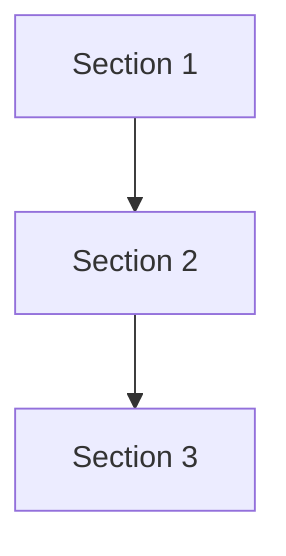

# MOC - {{title}}

{{Overview paragraph: what is this topic, why does it matter, what does this MOC cover.}}

## Source Material

- [[{{Primary Source}}]]

---

## Concept Flow (optional)

*{{Explanation: why these sections relate this way. What does each arrow represent?}}*

---

## {{Section Name}}

{{1-2 sentence intro: what theme unifies these notes.}}

- [[Note]]
- [[Note]]

*Relationship insight (if non-obvious).*

---

## {{Section Name}}

{{Section intro.}}

- [[Note]]
- [[Note]]

---

## Related

- [[MOC - Related Topic]]
- #topic/adjacent

## Open Questions

-
-
