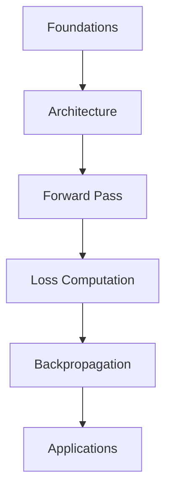

# MOC - Introduction to Deep Learning

Deep learning extends classical machine learning by using neural networks with multiple layers to automatically learn hierarchical feature representations. This lecture introduces the fundamental concepts: network architecture, forward propagation, loss functions, and the backpropagation algorithm that enables training.

## Source Material

- [[Transcript Lecture 01]]
- [[Summary - Lecture 01 Introduction to Deep Learning]]

---

## Concept Flow

*Foundations (motivation, history) lead to Architecture (layers, neurons). The Forward Pass computes predictions, Loss measures error, and Backpropagation enables learning. Together these enable Applications.*

---

## Foundations

Machine learning automates pattern recognition, but traditional methods require manual feature engineering.

| Note | Key Idea |
|------|----------|
| [[Machine learning automates pattern discovery from data]] | Learn rules from examples instead of programming them |
| [[Deep learning eliminates manual feature engineering]] | Networks learn what features matter automatically |

---

## Architecture

Neural networks organize computation in layers of interconnected neurons.

| Note | Key Idea |
|------|----------|
| [[Neural networks learn hierarchical feature representations]] | Each layer builds on the previous, from simple to complex |
| [[Activation functions introduce non-linearity enabling complex mappings]] | Without non-linearity, deep networks collapse to single layer |

---

## Training

Learning adjusts network weights to minimize prediction error.

| Note | Key Idea |
|------|----------|
| [[Loss functions measure prediction error to guide learning]] | Different tasks need different loss functions |
| [[Backpropagation enables efficient gradient computation through networks]] | Chain rule propagates error signal backward |
| [[Gradient descent iteratively improves network parameters]] | Small steps in direction that reduces loss |

---

## Applications

Deep learning powers modern AI systems across domains.

| Note | Key Idea |
|------|----------|
| [[Computer vision uses convolutional networks for image understanding]] | CNNs exploit spatial structure in images |
| [[Natural language processing uses transformer architectures]] | Attention mechanisms capture long-range dependencies |

---

## Related

- #topic/optimization - How training algorithms work
- #topic/regularization - Preventing overfitting
- #topic/transfer-learning - Reusing pretrained models

## Open Questions

- How deep should a network be for a given task?
- When does more data help vs. better architecture?
- How to interpret what networks learn?
